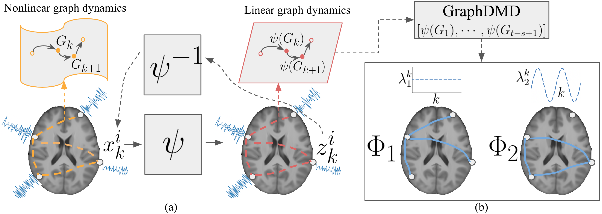

# DeepGraphDMD
Functional brain dynamics is supported by parallel and overlapping functional network modes that are associated with specific neural circuits. Decomposing these network modes from fMRI data and finding their temporal characteristics is challenging due to their time-varying nature and the non-linearity of the functional dynamics. Dynamic Mode Decomposition (DMD) algorithms have been quite popular for solving this decomposition problem in recent years. In this work, we apply GraphDMD --- an extension of the DMD for network data --- to extract the dynamic network modes and their temporal characteristics from the fMRI time series in an interpretable manner. GraphDMD, however, regards the underlying system as a linear dynamical system that is sub-optimal for extracting the network modes from non-linear functional data. In this work, we develop a generalized version of the GraphDMD algorithm --- DeepGraphDMD--- applicable to arbitrary non-linear graph dynamical systems. DeepGraphDMD is an autoencoder-based deep learning model that learns Koopman eigenfunctions for graph data and embeds the non-linear graph dynamics into a latent linear space. We show the effectiveness of our method in both simulated data and the HCP resting-state fMRI data. In the HCP data, DeepGraphDMD provides novel insights into cognitive brain functions by discovering two major network modes related to fluid and crystallized intelligence.

